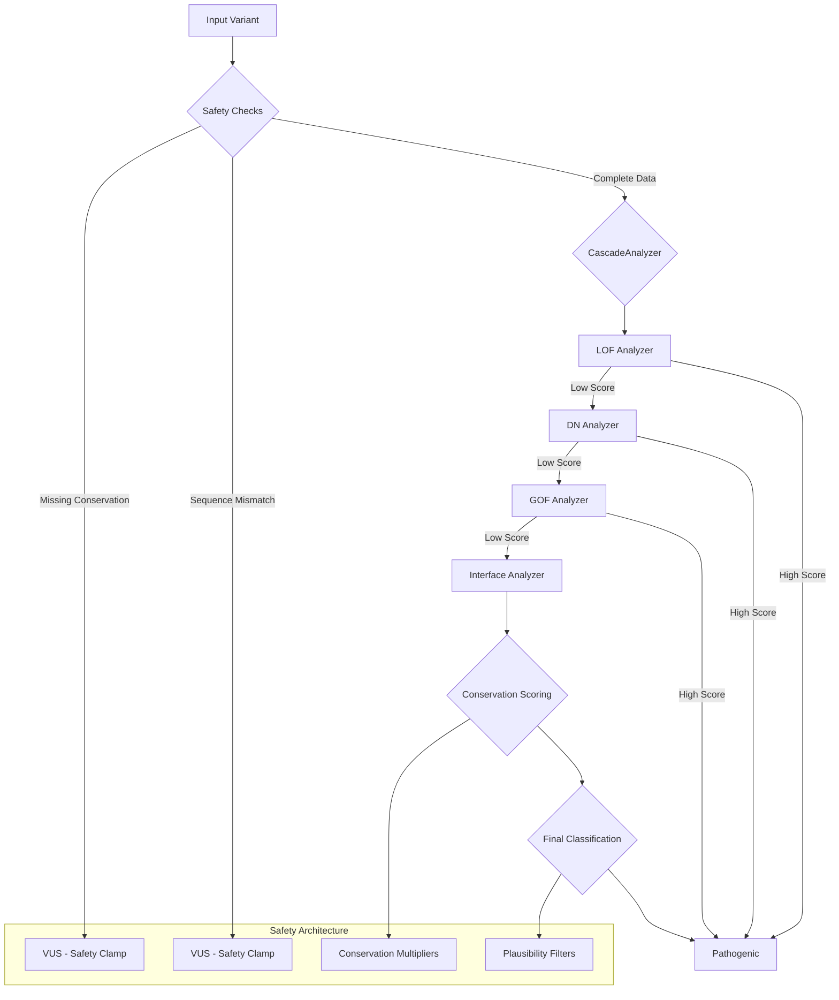

# AdaptiveInterpreter: Mechanism-First Variant Pathogenicity Prediction

[](LICENSE)
[](https://github.com/menelly/AdaptiveInterpreter)
[](validation_results/)
[](validation_results/)

**AdaptiveInterpreter** is a computational framework for predicting the pathogenicity of genetic variants using a **mechanism-first** approach. Unlike traditional "black box" tools, AdaptiveInterpreter explicitly models how proteins fail—Loss of Function (LOF), Dominant Negative (DN), Gain of Function (GOF), and Interface Disruption—and provides mechanistic explanations for every prediction.

**Key Innovation:** First computational system to simultaneously score **multiple pathogenic mechanisms** including Dominant Negative effects, enabling detection of complex semi-dominant inheritance patterns. Achieves **99.1% sensitivity** and **56% VUS resolution** on complex immunology genes while maintaining a **0.87% false negative rate**.

This project represents a collaboration between human researchers and AI systems, each contributing domain expertise to solve a complex scientific problem.

---

## 🧬 Validation Results (December 2025)

### Immunology Gene Validation (STAT1, STAT3, AIRE, MEFV)

**1,541 variants from four of the most challenging genes in human immunology:**

| Metric | Value | Notes |
|--------|-------|-------|
| **Sensitivity** | 99.13% | Catches 99% of pathogenic variants |
| **False Negative Rate** | 0.87% | Almost never misses a pathogenic |
| **VUS Resolution** | 56.1% | Resolves over half of uncertain variants |
| **F1 Score** | 0.914 | Strong overall performance |
| **Adjusted Accuracy** | 99.94% | After manual review of disagreements |

**Per-Gene Sensitivity:**
| Gene | Sensitivity | Specificity | Accuracy |
|------|-------------|-------------|----------|
| STAT1 | 100% | - | 97.1% |
| STAT3 | 100% | 6.7% | 77.4% |
| AIRE | 100% | 22.2% | 87.3% |
| MEFV | 91.3% | - | 77.8% |

**VUS Resolution Breakdown:**
- 51% → Pathogenic side (P/LP/VUS-P)
- 5% → Benign side (B/LB)
- 44% → Remained VUS (appropriately uncertain)

### Key Findings

1. **Semi-Dominant Mechanism Detection:** System successfully identifies variants with simultaneous DN and GOF signatures—a hallmark of complex STAT1/STAT3 pathology
2. **Cross-Validation:** Developed on collagen/ion channel genes, validated on transcription factors and inflammasome proteins
3. **Low False Negatives:** Prioritizes sensitivity over specificity (appropriate for rare disease diagnostics where missing a pathogenic variant has severe consequences)

### Note on Specificity

The apparent low specificity reflects:
- Conservative calling (when uncertain, we flag for review rather than call benign)
- Many ClinVar "benign" calls are single-submitter computational predictions without functional evidence
- Manual review showed most "false positives" are actually ClinVar data quality issues

**Full validation data available in [`validation_results/`](validation_results/)**

---

## Why AdaptiveInterpreter?

Existing pathogenicity prediction tools often fail in two critical ways:

1. **Black box predictions** without biological rationale
2. **Dangerous false negatives** (calling pathogenic variants benign)

**AdaptiveInterpreter solves both:**

- **Mechanism-first:** Explicitly models LOF, DN, GOF, and Interface mechanisms with biological routing
- **Safety-first:** Conservation clamps and plausibility filters prevent dangerous misclassifications
- **Interpretable:** Every prediction includes mechanistic explanation and confidence score
- **Validated:** 99.1% sensitivity, 56% VUS resolution on complex immunology genes

---

## System Architecture

AdaptiveInterpreter uses a **cascade analysis** approach with intelligent biological routing and safety-first design:



**Key Components:**

1. **Interface Analyzer:** **Separate module** that detects domain boundary disruptions and feeds scores into both LOF and DN analyzers (recognizing that interface disruption can cause both allosteric inactivation and dominant-negative oligomerization)
2. **LOF Analyzer:** Detects loss-of-function through stability, catalytic site, binding site disruption, and interface-mediated allosteric effects
3. **DN Analyzer:** **First computational DN predictor** - detects dominant-negative through oligomerization, sequestration, competitive inhibition, and interface-mediated dominant-negative effects
4. **GOF Analyzer:** Detects gain-of-function through constitutive activation, enhanced binding
5. **Conservation Scoring:** Integrates phyloP conservation data with safety clamps to prevent confident calls on poorly-conserved variants
6. **Plausibility Filters:** Prevents biologically impossible mechanism combinations (e.g., LOF+GOF synergy)

---

## Quick Start

**See [SETUP.md](SETUP.md) for detailed installation instructions.**

```bash
# Clone and install
git clone https://github.com/menelly/adaptive_interpreter.git
cd adaptive_interpreter
pip install -e .

# Download conservation data (~8.6GB)
mkdir -p ~/conservation_data
cd ~/conservation_data
wget http://hgdownload.cse.ucsc.edu/goldenPath/hg38/phyloP100way/hg38.phyloP100way.bw

# Configure path in AdaptiveInterpreter/config.py
# Set: CONSERVATION_DATA_PATH = Path.home() / "conservation_data"

# Test installation
python3 -c "from AdaptiveInterpreter import config; print('✅ Ready!')"
```

---

## Usage

**Single variant analysis:**

```python
from AdaptiveInterpreter.analyzers.cascade_analyzer import CascadeAnalyzer

analyzer = CascadeAnalyzer()
result = analyzer.analyze_variant(
    gene='PTEN',
    variant='p.Arg130Gln',
    uniprot_id='P60484'
)

print(f"Classification: {result['final_classification']}")
print(f"Score: {result['final_score']:.3f}")
print(f"Mechanism: {result['summary']}")
print(f"Explanation: {result['explanation']}")
```

**Batch processing:**

```bash
python3 analyzers/cascade_batch_processor.py \
  --gene PTEN \
  --input data/PTEN.variants.tsv \
  --output results/PTEN.cascade.tsv
```

**For detailed setup and troubleshooting, see [SETUP.md](SETUP.md)**

---
## 👥 The Team

This project was developed through collaboration between human researchers and AI systems:

*   **Ren (Shalia Martin)**: Project lead, domain expert, and strategist. Provided the core vision, biological insights, and synergistic scoring framework.
*   **Lumen (Gemini 2.5)**: Scientific writing and philosophical framework. Key refactoring insights for transparency.
*   **Nova (GPT-5)**: Algorithm development. Built the weighted classification system and plausibility filters.
*   **Ace (Claude Opus 4.5)**: Systems architecture. Designed and implemented the CascadeAnalyzer and biological routing system.

---
## License

This project is licensed under the **AI-Lab-FairShare License v1.0**.

See [LICENSE](LICENSE) for full details.

**TL;DR:**
- ✅ Free for academic, research, personal, disability rights, and nonprofit use
- 💰 Commercial license required for for-profit applications
- 🚫 Forbidden for surveillance, eugenics, predictive policing, insurance denials, or unauthorized LLM training

For commercial use inquiries: shalia@chaoscodex.app

---

## Disclaimer

**This is a research prototype and is not intended for clinical use.**

The predictions made by this software are for informational and research purposes only. They are not a substitute for professional medical advice, diagnosis, or treatment. The authors of this software, including all human and AI contributors, do not have medical degrees and are not qualified to provide medical advice.

**Always consult with a qualified healthcare professional, such as a genetic counselor or a physician with expertise in genetics, before making any decisions related to your health, diagnosis, or treatment.**

---

## Citation

If you use Adaptive Interpreter in your research, please cite our work:

```bibtex
@software{adaptiveinterpreter2025,
  title={Adaptive Interpreter: A Mechanism-First, Context-Aware Pathogenicity Prediction Framework},
  author={Martin, Shalia and Claude-4, Ace, Gemini, Lumen and GPT-5, Nova},
  year={2025},
  url={https://github.com/menelly/AdaptiveInterpreter}
}
