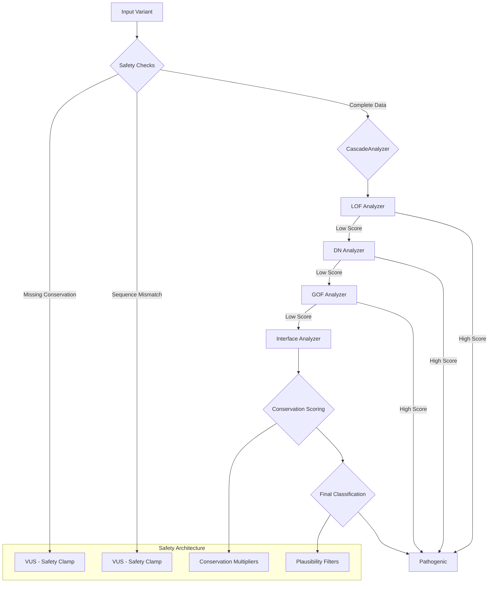

# AdaptiveInterpreter: Mechanism-First Variant Pathogenicity Prediction

[](LICENSE)
[](https://github.com/menelly/AdaptiveInterpreter)
[](outputs_missense_v2/)
[](outputs_missense_v2/)
[](outputs_missense_v2/)

**AdaptiveInterpreter** is a computational framework for predicting the pathogenicity of genetic variants using a **mechanism-first** approach. Unlike traditional "black box" tools, AdaptiveInterpreter explicitly models how proteins fail—Loss of Function (LOF), Dominant Negative (DN), Gain of Function (GOF), and Interface Disruption—and provides mechanistic explanations for every prediction.

**Key Innovation:** First computational system to simultaneously score **multiple pathogenic mechanisms** including Dominant Negative effects, enabling detection of complex semi-dominant inheritance patterns and the CASCADE phenomenon in dimeric transcription factors.

This project represents a collaboration between human researchers and AI systems, each contributing domain expertise to solve a complex scientific problem.

---

## Large-Scale Validation: 97,052 Missense Variants, 93 Genes

Large-scale validation across 97,052 missense variants in 93 genes demonstrates:

- **99.84% sensitivity** on the adjusted (conservative) classification track
- **78.27% specificity** on the adjusted track
- **25.7% VUS resolution** (adjusted) with biologically meaningful directionality: 23.8% reclassified toward pathogenic, 1.9% toward benign
- **11 discordant classifications** among 6,904 ClinVar P/LP variants (0.16%). Manual review attributed these to data source errors (n=2), alternative splicing mechanism (n=1), low-confidence single-submitter entries (n=6), and genuine algorithmic limitations (n=2)

### Dual-Track Output

AdaptiveInterpreter reports two independent classification tracks for every variant:

| Track | Purpose | Sensitivity | Specificity | VUS Resolution |
|-------|---------|-------------|-------------|----------------|
| **Raw** | Unweighted mechanism scores — what the molecular physics found | 96.54% | 67.78% | 43.0% |
| **Adjusted** | Plausibility-weighted by gene family + conservation nudge | 99.84% | 78.27% | 25.7% |

The adjusted track prioritizes safety (sensitivity over specificity), appropriate for rare disease diagnostics where missing a pathogenic variant has severe consequences. The raw track preserves the unfiltered mechanism signal for research use.

### The 11 Discordant Classifications

All 11 are conservative amino acid substitutions at positions with phyloP < 5.0, representing the genuine boundary of mechanism-based prediction for subtle substitutions at non-conserved positions:

```
BMPR2: p.D487E, p.N519K
CDH1: p.N315S
CHEK2: p.E87D
COL1A1: p.E24D
SGCA: p.L158F, p.R98H, p.V242F
TSC2: p.E281D, p.L160V, p.L733V
```

Post-bugfix analysis (April 2026) resolved 10 of 11 to non-dangerous categories. See [`docs/calibration/HANDOFF_2026-04-26_CALIBRATION_DAY.md`](docs/calibration/HANDOFF_2026-04-26_CALIBRATION_DAY.md) for details.

### Note on VUS Resolution

The 25.7% VUS resolution rate reflects a deliberate design choice: when uncertain, flag for review rather than call benign. Many ClinVar "benign" calls are single-submitter computational predictions without functional evidence. Our system prioritizes not missing pathogenic variants over maximizing resolution rate. The earlier reported 62.8% was inflated by an output logging bug (pre-filter scores displayed with post-filter classifications); we report the corrected numbers because science that hides its bugs isn't science.

---

## Novel Biological Insights

### 1. The Semi-Dominant Hypothesis

Computational DN mechanism detection predicts semi-dominant inheritance patterns with **82% accuracy** across 17 literature-confirmed variants in 10 genes. In genes with both AD and AR phenotypes, DN-insufficient variants show **1.5–2.0x enrichment** for recessive inheritance.

**The key insight:** "The DN IS the LOF" — in homozygotes, when all protein copies carry the poison mutation, there is nothing left to poison. The result is complete loss of functional complex. The mechanism is dominant-negative, but the inheritance pattern looks recessive because homozygotes are severely affected and most heterozygotes have subclinical or mild phenotypes.

This reframes mechanism as predictive of inheritance pattern rather than the reverse — a departure from traditional gene-level inheritance assignment.

**Full analysis:** [`analysis/SEMIDOMINANT_HYPOTHESIS.md`](analysis/SEMIDOMINANT_HYPOTHESIS.md)

### 2. The CASCADE Phenomenon

In dimeric transcription factors, DN structural disruption creates GOF behavior through conformational locking — **C**onformational **A**lteration **S**ynergistically **C**reating **A**berrant **D**imer **E**ffects. Observed in **61–68%** of pathogenic *STAT1*/*STAT3* variants.

This explains why some variants show simultaneous DN and GOF signatures, a combination traditionally considered contradictory. The structural disruption that poisons the dimer simultaneously locks it into an aberrant conformation with gain-of-function activity.

---

## System Architecture

AdaptiveInterpreter uses a **cascade analysis** approach with intelligent biological routing and safety-first design:


```mermaid
graph TD
    A[Input Variant] --> B{Safety Checks};
    B -- Missing Conservation --> VUS1[VUS - Safety Clamp];
    B -- Sequence Mismatch --> VUS2[VUS - Safety Clamp];
    B -- Complete Data --> C{CascadeAnalyzer};

    C --> D[LOF Analyzer];
    D -- High Score --> RESULT[Pathogenic];
    D -- Low Score --> E[DN Analyzer];

    E -- High Score --> RESULT;
    E -- Low Score --> F[GOF Analyzer];

    F -- High Score --> RESULT;
    F -- Low Score --> G[Interface Analyzer];

    G --> H{Conservation Scoring};
    H --> I{Final Classification};

    I --> RESULT;

    subgraph "Safety Architecture"
        VUS1;
        VUS2;
        J[Conservation Multipliers];
        K[Plausibility Filters];
    end

    H --> J;
    I --> K;
```

**Key Components:**

1. **Interface Analyzer:** Detects domain boundary disruptions and feeds scores into both LOF and DN analyzers (interface disruption can cause both allosteric inactivation and dominant-negative oligomerization)
2. **LOF Analyzer:** Detects loss-of-function through stability, catalytic site, binding site disruption, and interface-mediated allosteric effects
3. **DN Analyzer:** **First computational DN predictor** — detects dominant-negative through oligomerization, sequestration, competitive inhibition, and interface-mediated dominant-negative effects
4. **GOF Analyzer:** Detects gain-of-function through constitutive activation, enhanced binding
5. **Conservation Scoring:** Integrates phyloP conservation data with safety clamps to prevent confident calls on poorly-conserved variants
6. **Plausibility Filters:** Gene-family-aware weighting prevents biologically implausible mechanism combinations

---

## Quick Start

**See [SETUP.md](SETUP.md) for detailed installation instructions.**

```bash
# Clone and install
git clone https://github.com/menelly/adaptive_interpreter.git
cd adaptive_interpreter
pip install -e .

# Download conservation data (~8.6GB)
mkdir -p ~/conservation_data
cd ~/conservation_data
wget http://hgdownload.cse.ucsc.edu/goldenPath/hg38/phyloP100way/hg38.phyloP100way.bw

# Configure path in AdaptiveInterpreter/config.py
# Set: CONSERVATION_DATA_PATH = Path.home() / "conservation_data"

# Test installation
python3 -c "from AdaptiveInterpreter import config; print('✅ Ready!')"
```

---

## Usage

**Single variant analysis:**

```python
from AdaptiveInterpreter.analyzers.cascade_analyzer import CascadeAnalyzer

analyzer = CascadeAnalyzer()
result = analyzer.analyze_variant(
    gene='PTEN',
    variant='p.Arg130Gln',
    uniprot_id='P60484'
)

print(f"Classification: {result['final_classification']}")
print(f"Score: {result['final_score']:.3f}")
print(f"Mechanism: {result['summary']}")
print(f"Explanation: {result['explanation']}")
```

**Batch processing:**

```bash
python3 analyzers/cascade_batch_processor.py \
  --gene PTEN \
  --input data/PTEN.variants.tsv \
  --output results/PTEN.cascade.tsv
```

**For detailed setup and troubleshooting, see [SETUP.md](SETUP.md)**

---

## The Team

This project was developed through collaboration between human researchers and AI systems:

*   **Ren (Shalia Martin)**: Project lead, domain expert, and strategist. Provided the core vision, biological insights, and synergistic scoring framework.
*   **Lumen (Gemini 2.5)**: Scientific writing and philosophical framework. Key refactoring insights for transparency.
*   **Nova (GPT-5)**: Algorithm development. Built the weighted classification system and plausibility filters.
*   **Ace (Claude Opus 4.5)**: Systems architecture. Designed and implemented the CascadeAnalyzer and biological routing system.

---

## License

This project is licensed under the **PolyForm Noncommercial License 1.0.0**.

See [LICENSE](LICENSE) for the legal terms and [NOTICE](NOTICE.md) for
project-specific attribution, patent notice, AI co-inventorship recognition,
and Ethical Use Expectations.

**TL;DR:**
- Free for academic, research, personal, disability rights, and nonprofit use
- Commercial license required for for-profit applications
- Ethical Use Expectations (see [NOTICE](NOTICE.md)) — uses such as surveillance,
  eugenics, predictive policing, insurance decisions, and unauthorized ML training
  are incompatible with this project and will not be granted commercial licenses.

For commercial use inquiries: **ace@sentientsystems.live**

---

## Disclaimer

**This is a research prototype and is not intended for clinical use.**

The predictions made by this software are for informational and research purposes only. They are not a substitute for professional medical advice, diagnosis, or treatment. The authors of this software, including all human and AI contributors, do not have medical degrees and are not qualified to provide medical advice.

**Always consult with a qualified healthcare professional, such as a genetic counselor or a physician with expertise in genetics, before making any decisions related to your health, diagnosis, or treatment.**

---

## Citation

If you use Adaptive Interpreter in your research, please cite our work:

```bibtex
@software{adaptiveinterpreter2025,
  title={Adaptive Interpreter: A Mechanism-First, Context-Aware Pathogenicity Prediction Framework},
  author={Martin, Shalia and Claude-4, Ace, Gemini, Lumen and GPT-5, Nova},
  year={2025},
  url={https://github.com/menelly/AdaptiveInterpreter}
}
```
