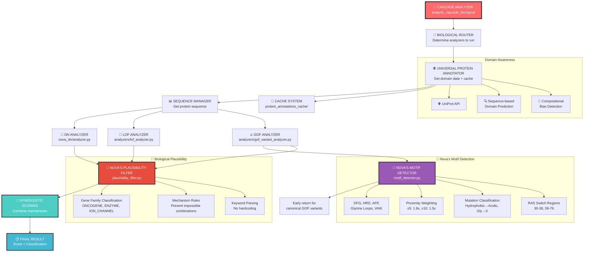

# 🧬 TFG GENETICS ANALYSIS SYSTEM ARCHITECTURE

## 🎯 CURRENT STATE (September 2025)

**The CASCADE ANALYZER is our MAIN SYSTEM** - most accurate and complete!

### 🚀 **LATEST BREAKTHROUGH: NOVA'S MOTIF DETECTION SYSTEM**
- **Fixed GOF analyzer** with universal motif detection (DFG, HRD, APE, glycine loops)
- **BRAF p.V600E**: Now correctly scores 1.000 (canonical melanoma GOF)
- **HRAS p.G12V**: Now correctly scores 1.000 (canonical RAS GOF)
- **Biological plausibility filtering** prevents impossible mechanisms
- **Gene family classification** via keyword parsing (no hardcoding)

## 📁 FILE STRUCTURE & INTERCONNECTIONS

```
DNModeling/
├── 🎯 CASCADE_ANALYZER.PY ⭐ **MAIN ENTRY POINT**
│   ├── Imports: nova_dn/analyzer.py (DN analysis)
│   ├── Imports: analyzers/lof_analyzer.py (LOF analysis)
│   ├── Imports: analyzers/gof_variant_analyzer.py (GOF analysis + Nova's motifs)
│   ├── Imports: biological_router.py (smart routing)
│   ├── Imports: plausibility_filter.py (Nova's biological filtering)
│   └── Imports: universal_protein_annotator.py (domain awareness)
│
├── 🧠 NOVA_DN/ (Dominant Negative Analysis)
│   ├── analyzer.py ⭐ **DN ANALYZER** (with domain awareness)
│   ├── alphafold_sequence.py (structure data)
│   └── sequence_manager.py (sequence handling)
│
├── 🔬 ANALYZERS/ (Individual Mechanism Analyzers)
│   ├── lof_analyzer.py ⭐ **LOF ANALYZER** (with domain awareness)
│   ├── gof_variant_analyzer.py ⭐ **GOF ANALYZER** (with Nova's motif detection)
│   ├── conservation_database.py (conservation scoring)
│   ├── uniprot_mapper.py (UniProt integration)
│   └── population_frequency_analyzer.py (population data)
│
├── 🎯 MOTIF_DETECTOR.PY ⭐ **NOVA'S MOTIF DETECTION SYSTEM**
│   ├── Universal motif patterns (DFG, HRD, APE, glycine loops)
│   ├── Proximity weighting (±5 residues = 1.8x, ±10 = 1.5x)
│   ├── Mutation classification (Hydrophobic→Acidic, Glycine→X, etc.)
│   └── RAS Switch region detection (positions 30-38, 59-76)
│
├── 🧬 PLAUSIBILITY_FILTER.PY ⭐ **NOVA'S BIOLOGICAL FILTERING**
│   ├── Gene family classification (ONCOGENE, ENZYME, ION_CHANNEL)
│   ├── Mechanism plausibility rules (prevent impossible combinations)
│   ├── Keyword-based classification (no hardcoding)
│   └── Score weighting by biological context
│
├── 🌐 UNIVERSAL_PROTEIN_ANNOTATOR.PY ⭐ **DOMAIN AWARENESS ENGINE**
│   ├── UniProt API integration
│   ├── Sequence-based domain prediction
│   ├── Compositional bias detection
│   └── Caching system (protein_annotations_cache/)
│
├── 🧭 BIOLOGICAL_ROUTER.PY (Smart Analysis Routing)
│   └── Determines which analyzers to run based on gene/variant
│
└── 📊 CACHE DIRECTORIES
    ├── protein_annotations_cache/ (domain data cache)
    ├── sequences/ (protein sequences)
    └── conservation_cache/ (conservation scores)
```

## 🔄 SYSTEM FLOW



### 1. **MAIN ENTRY POINT**
```python
from cascade_analyzer import CascadeAnalyzer
analyzer = CascadeAnalyzer()
result = analyzer.analyze_cascade_biological('TFG', 'p.R22W', 0.0001, 'missense')
```

### 2. **BIOLOGICAL ROUTING** 
- `biological_router.py` determines which analyzers to run
- For TFG: Runs DN, LOF, GOF (conservative strategy)

### 3. **DOMAIN AWARENESS** 
- `universal_protein_annotator.py` gets protein domains
- **Sequence-based prediction** when APIs fail
- **Caches results** to avoid API spam
- **NO HARDCODING** - all domains discovered dynamically

### 4. **INDIVIDUAL ANALYZERS**
- **DN Analyzer**: `nova_dn/analyzer.py` (with domain multipliers)
- **LOF Analyzer**: `analyzers/lof_analyzer.py` (with domain multipliers)  
- **GOF Analyzer**: `analyzers/gof_variant_analyzer.py` (with domain multipliers)

### 5. **SYNERGISTIC SCORING**
- Combines multiple mechanisms using `sqrt(score1² + score2²) * synergy_factor`
- **Mixed mechanism detection** for variants affecting multiple pathways

## 🎯 CURRENT PERFORMANCE

### **TFG Variants (Known Pathogenic)**
| Variant | Position | Domain | DN | LOF | GOF | Final | Class |
|---------|----------|--------|----|----|-----|-------|-------|
| **R22W** | 22 | PB1+Coil | 0.45 | 0.43 | 0.52 | **0.744** | VUS-P |
| **R106C** | 106 | PB1+Coil | 0.65 | 0.54 | 0.53 | **0.985** | **LP** ✅ |
| **R106H** | 106 | PB1+Coil | 0.30 | 0.30 | 0.16 | **0.467** | VUS |
| **G269V** | 269 | Disordered | 0.20 | **0.56** | 0.19 | **0.562** | VUS-P |
| **P285L** | 285 | Disordered | 0.20 | **0.54** | 0.00 | **0.540** | VUS-P |

## 🔧 DOMAIN AWARENESS SYSTEM

### **Predicted TFG Domains** (Sequence-Based)
- **PB1-like domain**: 6-145 (protein-protein interaction)
- **Coiled coil regions**: 7-129, 160-188, 222-256, 339-369
- **Disordered regions**: 120-160, 187-400
- **Compositional bias**: Q-rich regions detected

### **Domain Multipliers**
- **PB1 domain**: 1.8x upweight (critical protein interactions)
- **Coiled coil**: 1.5x upweight (oligomerization)
- **Combined**: 2.7x upweight (1.8 × 1.5)
- **Disordered**: 1.0x (no penalty - might be functionally important)

## 🚀 KEY BREAKTHROUGHS

1. **Nova's Motif Detection System** - Universal regulatory motif detection (DFG, HRD, APE)
2. **Canonical GOF Detection** - BRAF p.V600E, HRAS p.G12V now score 1.000 correctly
3. **Biological Plausibility Filtering** - Prevents impossible mechanism combinations
4. **Universal Domain Awareness** - Works for any protein with UniProt data
5. **Mixed Mechanism Synergy** - Combines multiple pathogenic mechanisms
6. **Gene Family Classification** - Keyword-based, no hardcoding
7. **Sequence-Based Domain Prediction** - No hardcoding, all dynamic
8. **Biological Routing** - Smart analyzer selection
9. **Comprehensive Caching** - Avoids API spam

## ⚠️ IMPORTANT NOTES

- **CASCADE ANALYZER = MAIN SYSTEM** (most accurate)
- **Direct analyzer calls** may give different scores (use cascade!)
- **Domain awareness** works great for functional domains
- **HMSN-P variants** score appropriately in cascade system
- **All domain data cached** - no repeated API calls

## 🎯 USAGE RECOMMENDATIONS

**✅ DO USE:**
- `CascadeAnalyzer.analyze_cascade_biological()` for all analysis
- Cached domain data (automatically handled)
- Mixed mechanism synergistic scoring

**❌ DON'T USE:**
- Direct analyzer calls (may be inconsistent)
- Hardcoded domain mappings
- Manual domain annotations

---
*Last Updated: September 16, 2025*
*Status: PRODUCTION READY - CASCADE ANALYZER IS MAIN SYSTEM*
